# Week 07: ESP32 Components - เนื้อหาประกอบการทดลอง
## การพัฒนาซอฟต์แวร์ด้วย Component-Based Architecture

**ระยะเวลาการบรรยาย:** 60 นาที  
**วัตถุประสงค์:** เข้าใจแนวคิด Component-Based Development ใน ESP-IDF และการประยุกต์ใช้ในการพัฒนา IoT Applications

---

## 📚 หัวข้อการบรรยาย

### ตอนที่ 1: Component-Based Architecture Fundamentals 
1. [แนวคิด Component-Based Development](#1-แนวคิด-component-based-development)
2. [ข้อดีของการใช้ Components](#2-ข้อดีของการใช้-components)
3. [ESP-IDF Component Model](#3-esp-idf-component-model)

### ตอนที่ 2: ESP-IDF Components Deep Dive 
4. [โครงสร้าง Component](#4-โครงสร้าง-component)
5. [CMake Build System](#5-cmake-build-system)
6. [Component Dependencies](#6-component-dependencies)

### ตอนที่ 3: Component Management Strategies 
7. [Local vs Managed Components](#7-local-vs-managed-components)
8. [Component Registry และ Version Control](#8-component-registry-และ-version-control)
9. [Team Development Workflow](#9-team-development-workflow)

### ตอนที่ 4: Best Practices และ Case Studies 
10. [Component Design Patterns](#10-component-design-patterns)
11. [Testing และ Documentation](#11-testing-และ-documentation)
12. [สรุปและเตรียมตัวสำหรับการทดลอง](#12-สรุปและเตรียมตัวสำหรับการทดลอง)

---

## 1. แนวคิด Component-Based Development

### 1.1 ความหมายของ Component

**Component** คือหน่วยซอฟต์แวร์ที่:
- มีความเป็นอิสระ (Independent)
- สามารถนำไปใช้ซ้ำได้ (Reusable)
- มี Interface ที่ชัดเจน
- ซ่อนรายละเอียดการทำงานภายใน (Encapsulation)

> เทียบได้กับการประกอบรถยนต์ ซึ่ง Component ก็เหมือนชิ้นส่วนต่าง ๆ ของรถยนต์
> - แต่ละชิ้นทำงานได้ด้วยตัวเอง (เช่น เครื่องยนต์, เบรก, ระบบไฟฟ้า)
> - นำไปใช้กับรถรุ่นอื่นที่ใช้พาร์ทเดียวกันได้
> - มีจุดต่อ (interface) มาตรฐาน เช่น ขนาดน็อต ขั้วไฟ ที่แน่นอน
> - ไม่จำเป็นต้องรู้ว่าข้างในเครื่องยนต์ทำงานยังไง แค่รู้วิธีใช้และบำรุงรักษา

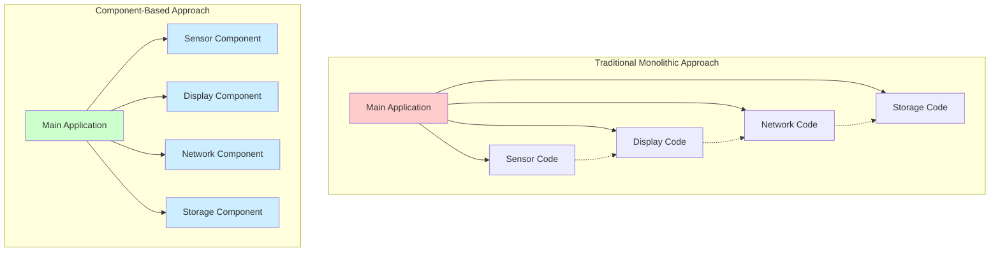

### 1.2 Software Engineering Principles

Component-Based Development อิงตามหลักการ Software Engineering

> ** หลักการสำคัญ 4 ข้อที่ควรจำ **
> 1. **Modularity** = แยกเป็นส่วนๆ เหมือนโรงงานรถยนต์ที่แยกประกอบชิ้นส่วนแต่ละส่วน
> 2. **Reusability** = ใช้ซ้ำได้ เหมือนเครื่องยนต์รุ่นเดียวกันที่ใช้ได้กับรถหลายรุ่น
> 3. **Abstraction** = ซ่อนความซับซ้อน เหมือนการขับรถที่เราแค่เหยียบคันเร่ง ไม่ต้องรู้ว่าข้างในเครื่องยนต์ทำงานยังไง หรือคนที่เป็นช่างที่รู้ทุกรายละเอียด มาขับรถก็ย่อมได้
> 4. **Separation of Concerns** = แยกหน้าที่ให้ชัดเจน เหมือนในศูนย์บริการรถยนต์ที่มีช่างเครื่อง ช่างไฟฟ้า ช่างแอร์ แยกความเชี่ยวชาญกัน

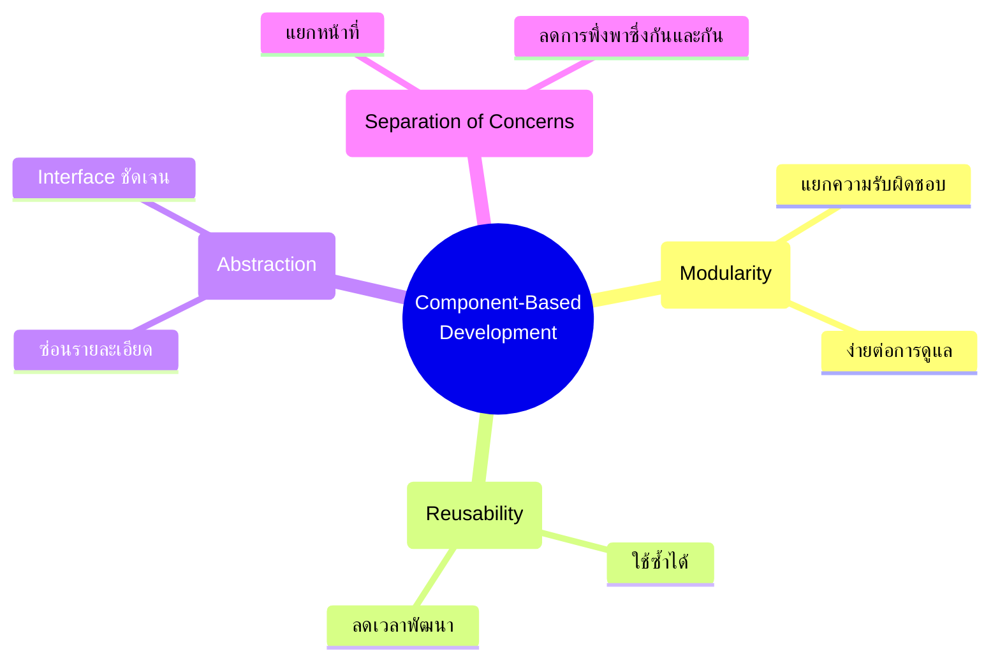

## 2. ข้อดีของการใช้ Components

### 2.1 ประโยชน์ในการพัฒนา

> - **Code Reusability** = เหมือนการใช้อะไหล่มาตรฐาน สามารถใช้กับรถหลายรุ่นได้
> - **Modularity** = แยกเป็นระบบย่อยๆ ถ้าเบรกมีปัญหา ก็เปลี่ยนแค่ระบบเบรก ไม่ต้องเปลี่ยนทั้งคัน
> - **Team Collaboration** = ทีมช่างแต่ละคนรับผิดชอบคนละระบบ เช่น ช่างเครื่อง ช่างไฟฟ้า ช่างแอร์
> - **Testing** = ทดสอบแต่ละระบบได้แยกกัน เช่น เช็คระบบเบรก ระบบไฟ ก่อนส่งมอบรถ

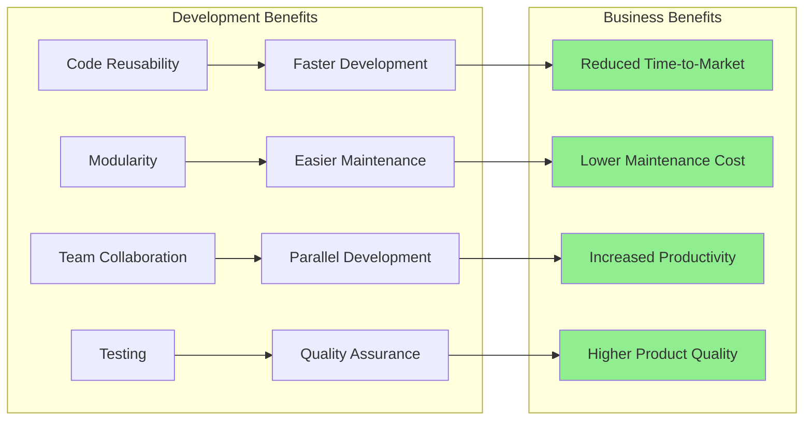

### 2.2 Component Lifecycle Management

**วงจรชีวิตของ Component เหมือนการทำการบ้าน**
> 1. **Design** = วางแผนว่าจะทำอะไร เหมือนอ่านโจทย์การบ้าน
> 2. **Development** = เริ่มเขียนโค้ด เหมือนลงมือทำการบ้าน
> 3. **Testing** = ทดสอบว่าทำงานถูกไหม เหมือนตรวจทานการบ้าน
> 4. **Documentation** = เขียนอธิบายวิธีใช้ เหมือนจดวิธีทำไว้ให้เพื่อนดู
> 5. **Publication** = ปล่อยให้คนอื่นใช้ เหมือนส่งการบ้าน
> 6. **Maintenance** = คอยดูแลแก้ไขถ้ามีปัญหา เหมือนแก้การบ้านหลังครูตรวจ

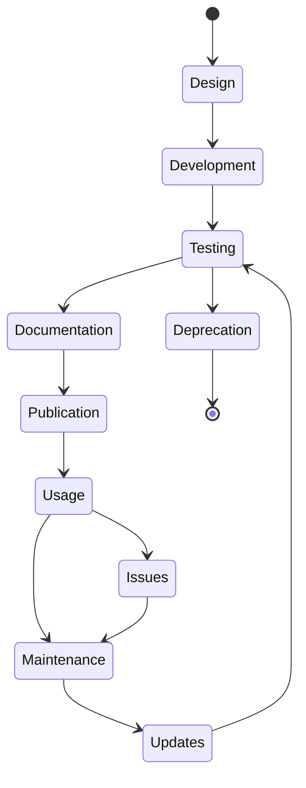

## 3. ESP-IDF Component Model

### 3.1 ESP-IDF Architecture Overview

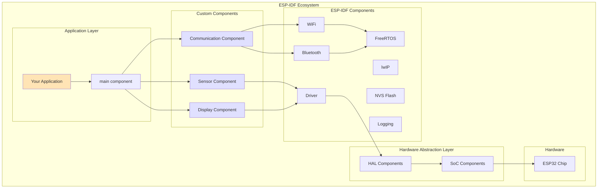

### 3.2 Component Registration Process

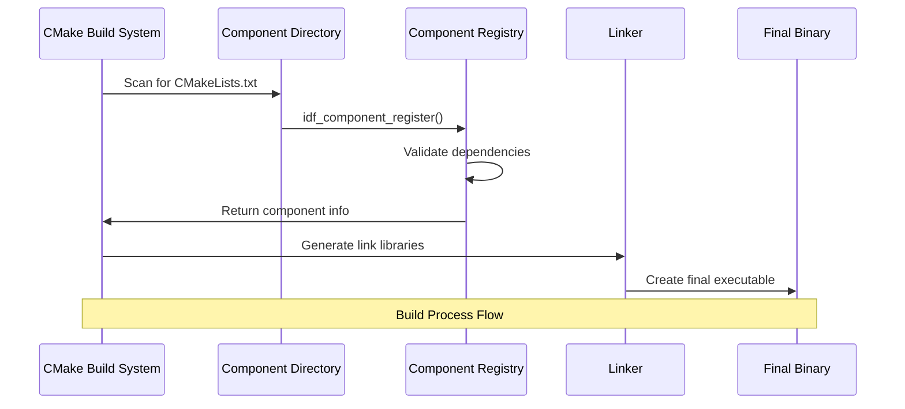

## 4. โครงสร้าง Component

### 4.1 Component Directory Structure

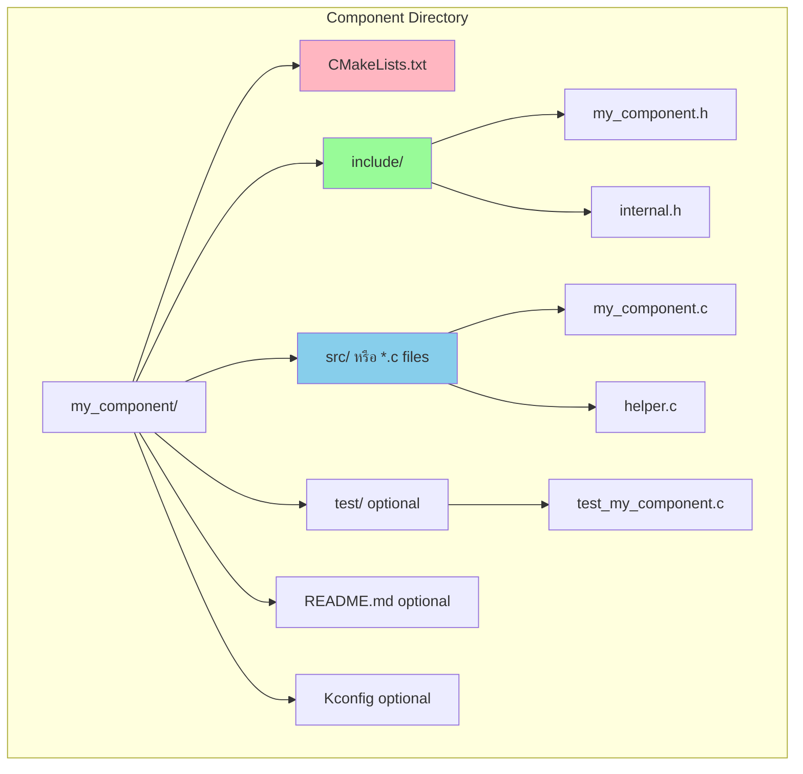

### 4.2 Component Interface Design (APIs)

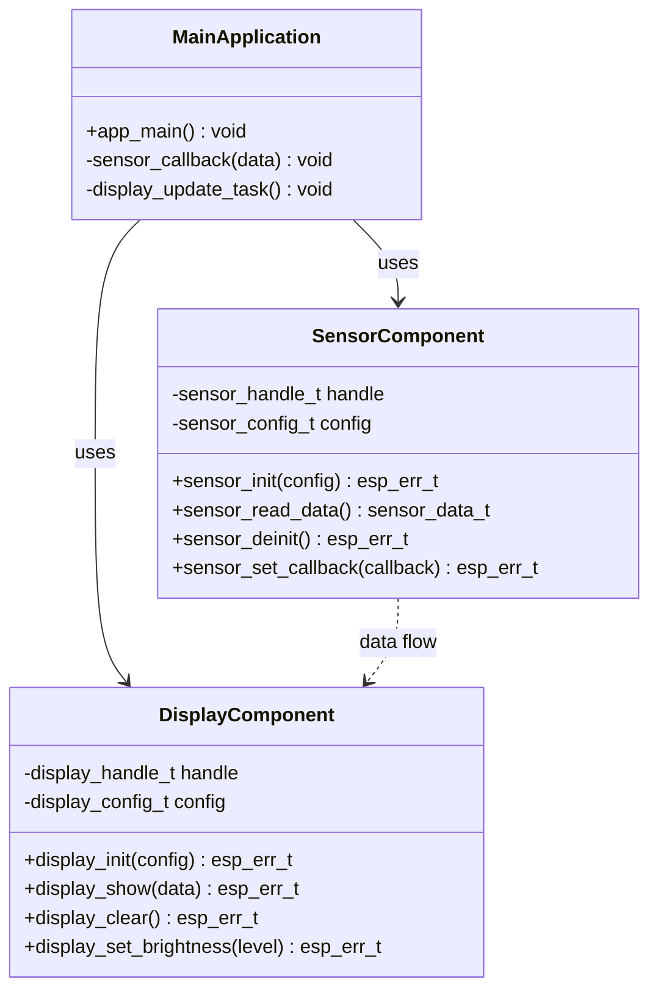

## 5. CMake Build System

### 5.1 CMake Component Registration

```cmake
# CMakeLists.txt ใน component
idf_component_register(
    SRCS "src/sensor.c" "src/helper.c"
    INCLUDE_DIRS "include"
    REQUIRES "driver" "log" "esp_timer"
    PRIV_REQUIRES "nvs_flash"
    PRIV_INCLUDE_DIRS "src"
)
```

**SRCS "src/sensor.c" "src/helper.c"**

ระบุไฟล์ซอร์ส (.c) ที่จะถูกคอมไพล์เป็นส่วนหนึ่งของคอมโพเนนต์นี้ เช่น sensor.c และ helper.c ในโฟลเดอร์ src

**INCLUDE_DIRS "include"**

ระบุโฟลเดอร์ที่มีไฟล์ header (.h) ที่จะถูกเพิ่มเข้าไปใน include path ของคอมโพเนนต์นี้ (เช่น include/)

**REQUIRES "driver" "log" "esp_timer"**

ระบุว่าคอมโพเนนต์นี้ต้องใช้คอมโพเนนต์อื่นๆ (dependencies) เช่น driver, log, esp_timer ซึ่งเป็น library ของ ESP-IDF

**PRIV_REQUIRES "nvs_flash"**

ระบุ dependencies ที่ใช้เฉพาะภายในคอมโพเนนต์นี้ (private) เช่น nvs_flash

**PRIV_INCLUDE_DIRS "src"**

ระบุโฟลเดอร์ header (.h) ที่ใช้เฉพาะภายในคอมโพเนนต์นี้ (private) เช่น src/

- แต่ละบรรทัดใช้กำหนดไฟล์ซอร์ส, ไฟล์ header, และ dependencies ที่จำเป็นสำหรับการ build คอมโพเนนต์ในโปรเจกต์ ESP-IDF ช่วยให้ build system รู้ว่าจะต้องคอมไพล์ไฟล์ไหนและต้องใช้ library อะไรบ้าง


- ไฟล์ header ใน INCLUDE_DIRS จะถูกมองเห็นจากคอมโพเนนต์อื่นด้วย

- ไฟล์ header ใน PRIV_INCLUDE_DIRS จะถูกมองเห็นเฉพาะในคอมโพเนนต์นี้เท่านั้น


### 5.2 Build Dependency Graph

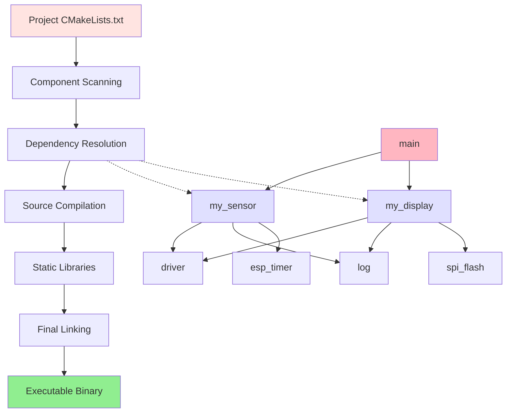

### 5.3 Component Configuration with Kconfig

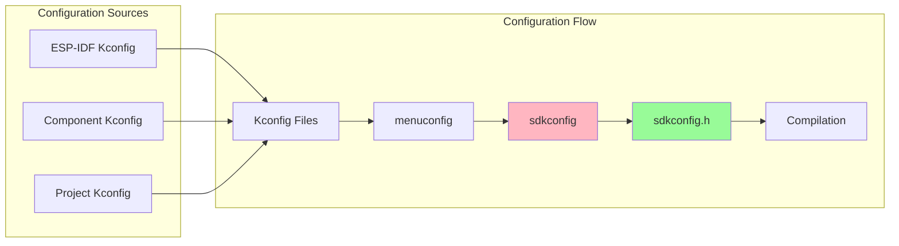

## 6. Component Dependencies

### 6.1 Dependency Types

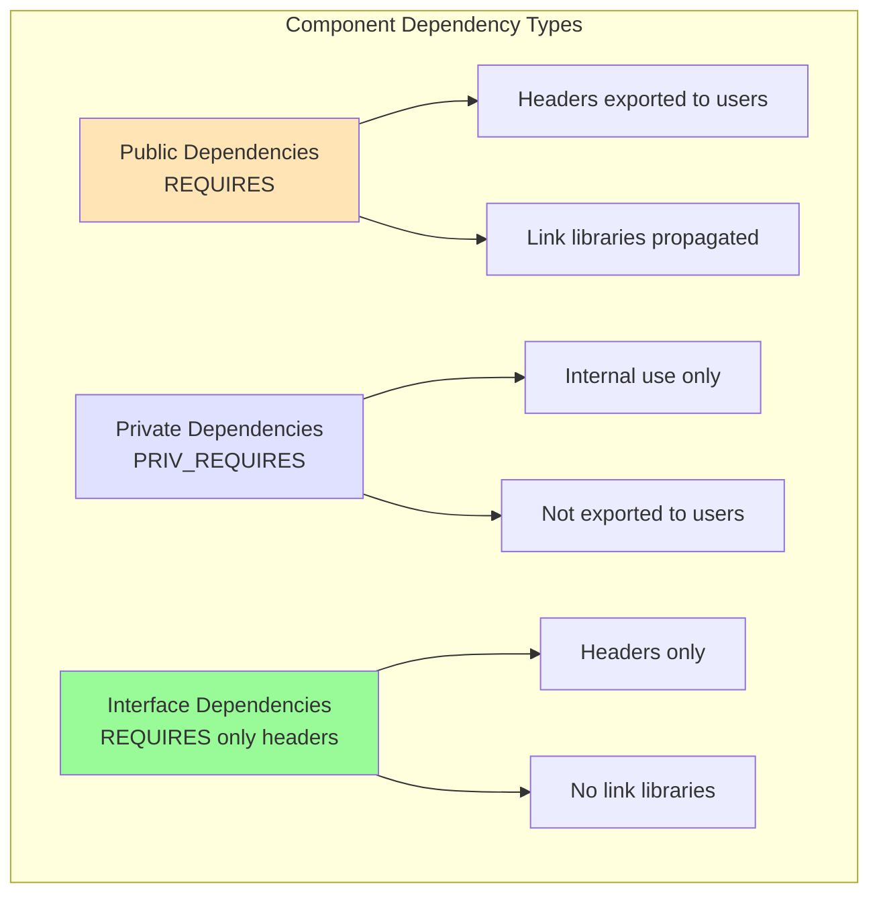

### 6.2 Circular Dependency Resolution

> **🎓 ปัญหาวงจรนรก**
> 
> **ตัวอย่างในชีวิตประจำวัน:**
> - **ปัญหา:** ลืมกุญแจรถไว้ในบ้าน แต่กุญแจบ้านก็ดันอยู่ในรถ = ไม่สามารถเข้าถึงทั้งสองอย่างได้!
> 
> **วิธีแก้:**
> 1. **แบบมีคนกลาง (Interface Component):**
>    - ฝากกุญแจสำรองไว้กับเพื่อนบ้าน
>    - เพื่อนบ้านเป็น "ตัวกลาง" ที่ช่วยแก้ปัญหาการพึ่งพากันแบบวงกลม
> 
> 2. **แบบระบบอัตโนมัติ (Event System):**
>    - ติดตั้งระบบรีโมทไร้กุญแจที่รถ
>    - ติดตั้งระบบล็อคอัตโนมัติที่บ้าน
>    - ทั้งสองระบบทำงานแยกกัน ไม่ต้องพึ่งพากุญแจอีกต่อไป

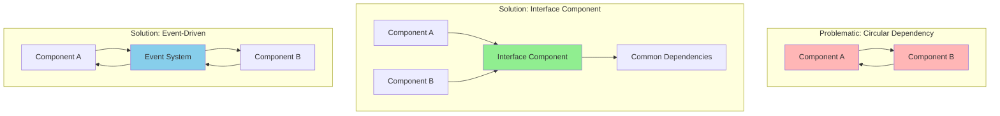

## 7. Local vs Managed Components

### 7.1 Component Sources Comparison

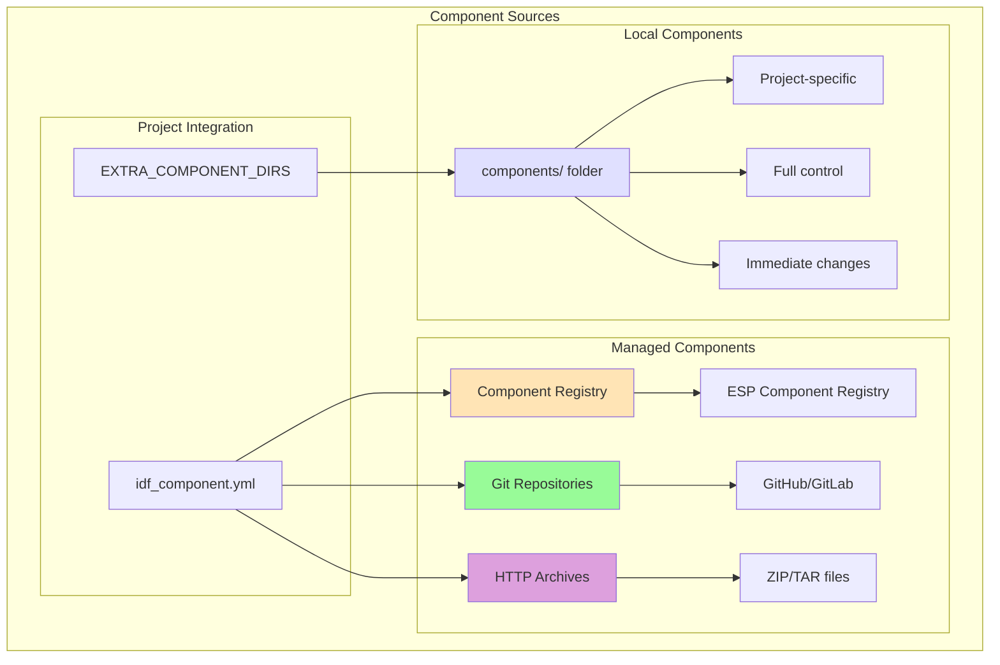

### 7.2 Component Lifecycle and Management

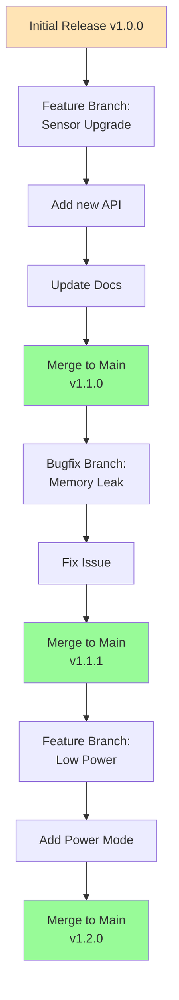

### 7.3 idf_component.yml Configuration

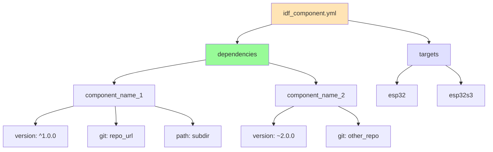

## 8. Component Registry และ Version Control

### 8.1 Semantic Versioning in Components

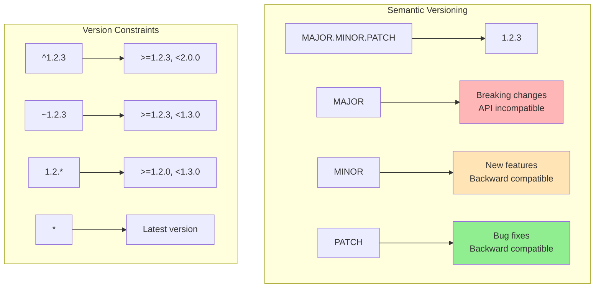

### 8.2 Component Registry Workflow

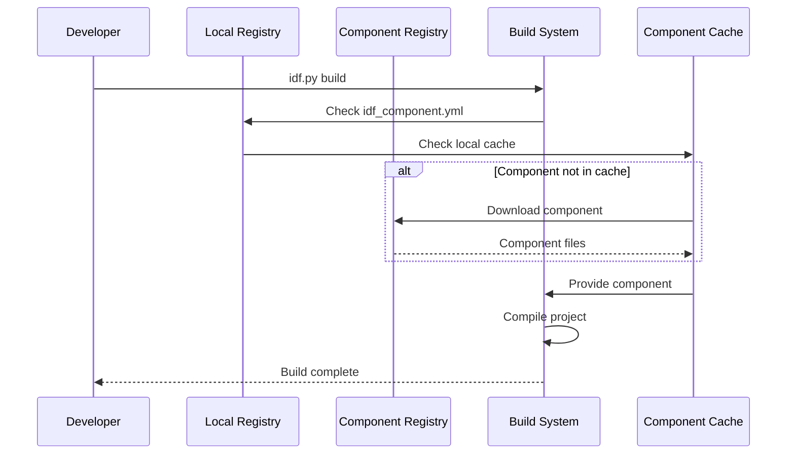

## 9. Team Development Workflow

### 9.1 Component Development Team Structure

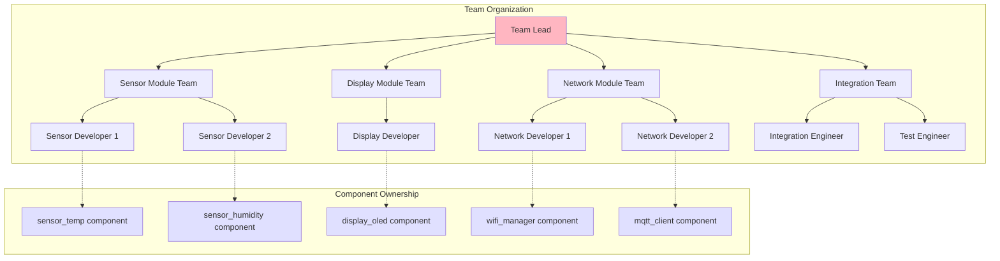

### 9.2 Git Workflow for Component Development

> **🎓 Git Workflow เหมือนการทำโปรเจคกลุ่ม**
> 
> 1. **Initial Project** = เริ่มต้นโปรเจค เหมือนอาจารย์แจกโจทย์
> 2. **แตก Branch** = แบ่งงานกัน เช่น คนนึงทำ Sensor อีกคนทำ Display
> 3. **พัฒนาแต่ละส่วน** = ต่างคนต่างทำงานที่ได้รับมอบหมาย
> 4. **Merge to Main** = เอางานแต่ละส่วนมารวมกัน
> 5. **Integration** = ทดสอบว่าทุกส่วนทำงานร่วมกันได้ดี
> 6. **Release** = ส่งงานอาจารย์

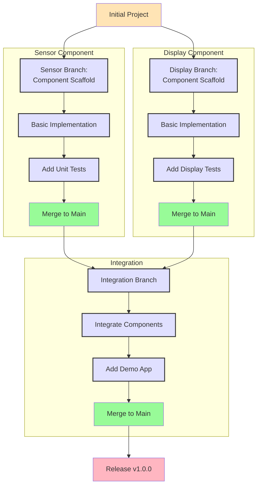

### 9.3 Component Testing Strategy

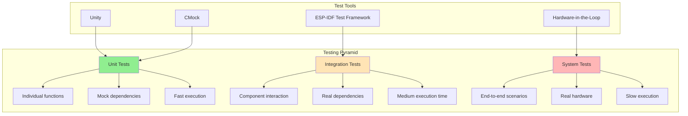

## 10. Component Design Patterns

### 10.1 Common Component Patterns

> **🎓 4 รูปแบบการออกแบบ Component ที่พบบ่อย:**
> 
> **1. Singleton Pattern - เหมือนผู้จัดการคนเดียว**
> - มีตัวจัดการแค่ตัวเดียว (เหมือนร้านที่มีผู้จัดการคนเดียว)
> - เข้าถึงได้จากทุกที่ในระบบ (ทุกแผนกติดต่อผู้จัดการคนนี้ได้)
> - สร้างเมื่อจำเป็นต้องใช้ (ถ้าไม่มีใครเรียกหา ก็ไม่ต้องมี)

```mermaid
flowchart TD
    subgraph Singleton[Singleton Pattern]
        PM[ผู้จัดการ] --> |มีได้<br>1 คน| W1[พนักงาน 1]
        PM --> |ติดต่อ| W2[พนักงาน 2]
        PM --> |สั่งงาน| W3[พนักงาน 3]
    end
    style PM fill:#FFE4B5,stroke-width:3px
    style W1 fill:#fff,stroke-width:2px
    style W2 fill:#fff,stroke-width:2px
    style W3 fill:#fff,stroke-width:2px
```

```mermaid
flowchart TD
    subgraph Factory[Factory Pattern]
        F[โรงงานผลิตเซนเซอร์] --> S1[เซนเซอร์วัดอุณหภูมิ]
        F --> S2[เซนเซอร์วัดความชื้น]
        F --> S3[เซนเซอร์วัดแสง]
        F --> S4[เพิ่มชนิดใหม่ได้...]
    end
    style F fill:#E0E0FF,stroke-width:3px
    style S1 fill:#fff,stroke-width:2px
    style S2 fill:#fff,stroke-width:2px
    style S3 fill:#fff,stroke-width:2px
    style S4 fill:#fff,stroke-width:2px
```

```mermaid
flowchart TD
    subgraph Observer[Observer Pattern - เหมือนกลุ่ม LINE]
        L[กลุ่ม LINE] --> |ส่งข่าว| M1[สมาชิก 1]
        L --> |แจ้งเตือน| M2[สมาชิก 2]
        L --> |อัพเดท| M3[สมาชิก 3]
        M4[สมาชิกใหม่] -.-> |เข้ากลุ่ม| L
        M5[ออกกลุ่ม] -.-> |ออก| L
    end
    style L  fill:#98FB98,stroke-width:3px
    style M1 fill:#fff,stroke-width:2px
    style M2 fill:#fff,stroke-width:2px
    style M3 fill:#fff,stroke-width:2px
    style M4 fill:#fff,stroke-width:2px
    style M5 fill:#fff,stroke-width:2px
```

```mermaid
flowchart TD
    subgraph Strategy[Strategy Pattern - เหมือนเลือกวิธีส่งของ]
        D[ระบบส่งของ] --> |ด่วนพิเศษ| D1[Kerry]
        D --> |ราคาประหยัด| D2[ไปรษณีย์]
        D --> |ส่งในกรุงเทพ| D3[Grab]
        D -.-> |เพิ่มตัวเลือก| D4[วิธีใหม่ๆ]
    end
    style D fill:#DDA0DD,stroke-width:3px
    style D1 fill:#fff,stroke-width:2px
    style D2 fill:#fff,stroke-width:2px
    style D3 fill:#fff,stroke-width:2px
    style D4 fill:#fff,stroke-width:2px
```

### 10.2 Component Communication Patterns

```mermaid
sequenceDiagram
    participant App as Application
    participant SM as Sensor Manager
    participant Sensor as Sensor Component
    participant Queue as Event Queue
    participant Display as Display Component
    
    App->>SM: Initialize
    SM->>Sensor: sensor_init()
    Sensor-->>SM: Success
    
    loop Every 1 second
        SM->>Sensor: sensor_read()
        Sensor-->>SM: data
        SM->>Queue: publish_event(data)
        Queue->>Display: sensor_data_event
        Display->>Display: update_display(data)
    end
```

### 10.3 Error Handling in Components

> **🎓 การจัดการความผิดพลาดเหมือนการแก้ปัญหาในชีวิตประจำวัน**
> 
> 1. **Error Detection** = จับได้ว่ามีปัญหา เช่น โทรศัพท์ไม่ติด
> 2. **Error Classification** = ระบุว่าเป็นปัญหาอะไร เช่น แบตหมด/เครื่องค้าง
> 3. **Error Reporting** = แจ้งปัญหา เช่น บอกว่า "แบตหมด กรุณาชาร์จ"
> 4. **Error Recovery** = แก้ปัญหา เช่น เสียบชาร์จ/รีสตาร์ทเครื่อง
> 5. **Error Logging** = จดไว้เป็นประวัติ เผื่อเกิดปัญหาซ้ำ

```mermaid
graph TB
    subgraph "Error Handling Strategy"
        A[Error Detection] --> B[Error Classification]
        B --> C[Error Reporting]
        C --> D[Error Recovery]
        D --> E[Error Logging]
    end
    
    subgraph "Error Types"
        F[Hardware Errors] --> F1[Sensor disconnected]
        F --> F2[Communication timeout]
        
        G[Software Errors] --> G1[Invalid parameters]
        G --> G2[Memory allocation failure]
        
        H[Configuration Errors] --> H1[Missing config]
        H --> H2[Invalid settings]
    end
    
    subgraph "Recovery Strategies"
        I[Retry Mechanism] --> I1[Exponential backoff]
        J[Fallback Mode] --> J1[Safe defaults]
        K[Reset/Restart] --> K1[Component reinit]
    end
    
    B --> F
    B --> G
    B --> H
    
    D --> I
    D --> J
    D --> K
    
    style A fill:#FFB6B6
    style D fill:#90EE90
```

## 11. Testing และ Documentation

### 11.1 Component Documentation Structure

```mermaid
graph TB
    subgraph "Documentation Types"
        A[API Reference] --> A1[Function signatures]
        A --> A2[Parameter descriptions]
        A --> A3[Return values]
        A --> A4[Code examples]
        
        B[User Guide] --> B1[Getting started]
        B --> B2[Configuration guide]
        B --> B3[Troubleshooting]
        
        C[Developer Guide] --> C1[Architecture overview]
        C --> C2[Extending the component]
        C --> C3[Contributing guidelines]
        
        D[Changelog] --> D1[Version history]
        D --> D2[Breaking changes]
        D --> D3[Migration guides]
    end
    
    style A fill:#E0E0FF
    style B fill:#FFE4B5
    style C fill:#98FB98
    style D fill:#DDA0DD
```

### 11.2 Continuous Integration Pipeline

> **🎓 CI/CD Pipeline เหมือนการส่งการบ้านออนไลน์:**
> 
> 1. **Code Push** = ส่งการบ้าน
> 2. **Static Analysis** = ระบบตรวจรูปแบบการเขียน
> 3. **Unit Tests** = ตรวจว่าแต่ละข้อถูกไหม
> 4. **Integration Tests** = ตรวจว่าทุกข้อทำงานร่วมกันได้
> 5. **Build Verification** = ตรวจว่าคอมไพล์ผ่านไหม
> 6. **Documentation** = ตรวจว่าเขียนอธิบายครบไหม
> 7. **Package & Publish** = ให้คะแนนและบันทึกผล

```mermaid
graph LR
    subgraph "CI/CD Pipeline"
        A[Code Push] --> B[Static Analysis]
        B --> C[Unit Tests]
        C --> D[Integration Tests]
        D --> E[Build Verification]
        E --> F[Documentation Generation]
        F --> G[Package & Publish]
    end
    
    subgraph "Quality Gates"
        H[Code Coverage > 80%]
        I[No Critical Issues]
        J[All Tests Pass]
        K[Documentation Complete]
    end
    
    C -.-> H
    B -.-> I
    D -.-> J
    F -.-> K
    
    style A fill:#87CEEB
    style G fill:#90EE90
```

## 12. สรุปและเตรียมตัวสำหรับการทดลอง

### 12.1 สรุปแนวคิดสำคัญ

```mermaid
mindmap
  root((ESP32 Components))
    (Architecture)
      Component-based design
      Modular development
      Clear interfaces
    (Management)
      Local components
      Managed components
      Version control
    (Development)
      CMake build system
      Dependency management
      Testing strategies
    (Collaboration)
      Team workflows
      Git strategies
      Documentation
```

### 12.2 Lab Roadmap

```mermaid
journey
    title Component Development Journey
    section Lab 7.1
      Setup Environment: 3: Student
      Create Local Component: 4: Student
      Build & Test: 5: Student
    section Lab 7.2
      Configure Managed Component: 4: Student
      Download from GitHub: 5: Student
      Integration Testing: 4: Student
    section Lab 7.3
      Create Custom Components: 5: Student
      Multi-component Project: 5: Student
      Team Workflow: 4: Student
```

### 12.3 การเตรียมตัวสำหรับการทดลอง

#### สิ่งที่ควรจำ:
1. **Component Structure** - CMakeLists.txt, include/, source files
2. **Dependency Management** - REQUIRES vs PRIV_REQUIRES
3. **Build Process** - idf.py commands และ CMake integration
4. **Version Control** - Git workflow สำหรับ components

#### เครื่องมือที่ต้องใช้:
- Docker และ ESP-IDF environment
- Git สำหรับ version control
- Text editor หรือ IDE
- Terminal/Command line

#### ทักษะที่จะได้รับ:
- ✅ การออกแบบ component architecture
- ✅ การจัดการ dependencies
- ✅ การใช้งาน managed components
- ✅ การทำงานเป็นทีมด้วย Git
- ✅ การทดสอบและ documentation

---

## 🎯 คำถามท้าทาย (สำหรับการอภิปราย)

1. **เมื่อไหร่ควรสร้าง component ใหม่** แทนที่จะเขียนโค้ดใน main application?

2. **ความแตกต่างระหว่าง REQUIRES และ PRIV_REQUIRES** ส่งผลต่อการ compile อย่างไร?

3. **การเลือกใช้ local component vs managed component** ขึ้นอยู่กับปัจจัยใดบ้าง?

4. **ในทีมงานขนาดใหญ่** จะจัดการ component dependencies อย่างไรให้มีประสิทธิภาพ?

5. **การทดสอบ component** ที่มีการพึ่งพา hardware ทำได้อย่างไร?

---

**หมายเหตุ:** เนื้อหานี้เป็นการเตรียมความพร้อมสำหรับการทดลอง หลังจากการบรรยายนี้ นักศึกษาจะได้ลงมือปฏิบัติจริงใน Lab 7.1-7.3 เพื่อประยุกต์ใช้ความรู้ที่ได้เรียน
